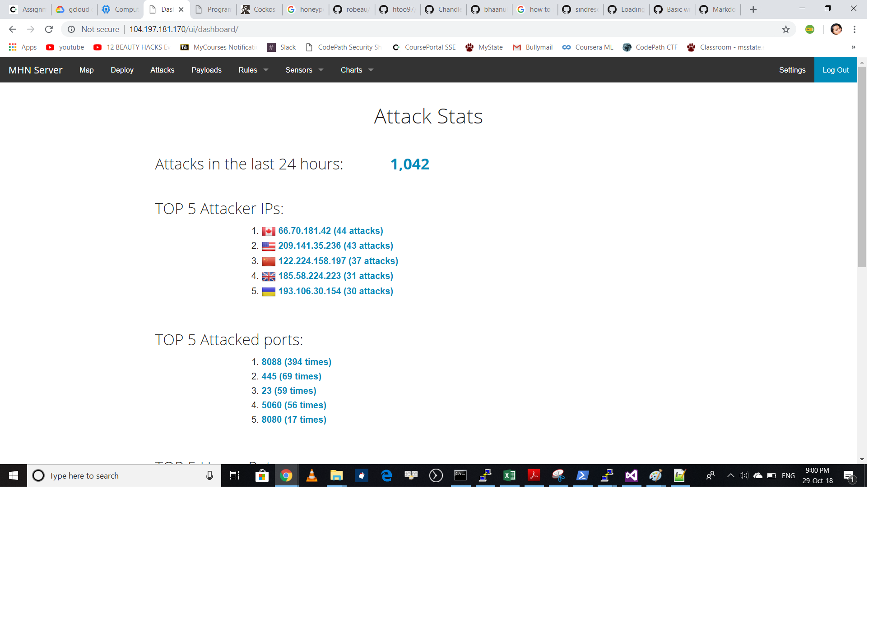

# CodepathWeek9
## Honepots Deployed
1. Dionaea (1042 attacks)

## Brief
I deployed a Dionaea honeypot using an admin virtual machine and one honeypot.

I encountered issues while installing loading the external ip but the scripts from MHN helped to work out.
A summary of the data collected: number of attacks, number of malware samples, etc

## Data Collected
Attacks in the last 24 hours: 1,042
TOP 5 Attacker IPs:
  66.70.181.42 (44 attacks)
  209.141.35.236 (43 attacks)
  122.224.158.197 (37 attacks)
  185.58.224.223 (31 attacks)
  193.106.30.154 (30 attacks)
  
TOP 5 Attacked ports:
  8088 (394 times)
  445 (69 times)
  23 (59 times)
  5060 (56 times)
  8080 (17 times)
  
TOP 5 Honey Pots:
  dionaea (1,042 attacks)
  
TOP 5 Sensors:
  mhn-honeypot-1 (1,042 attacks)
